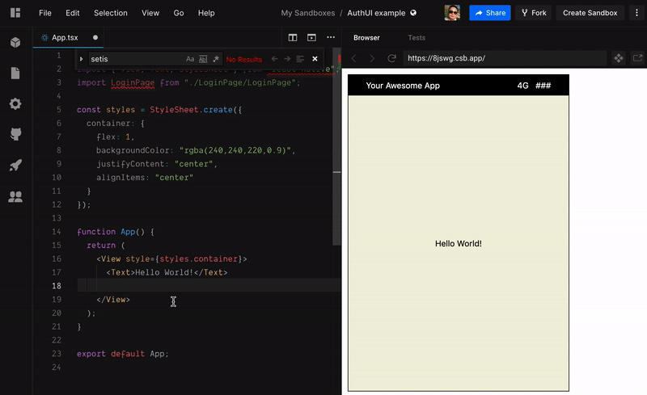
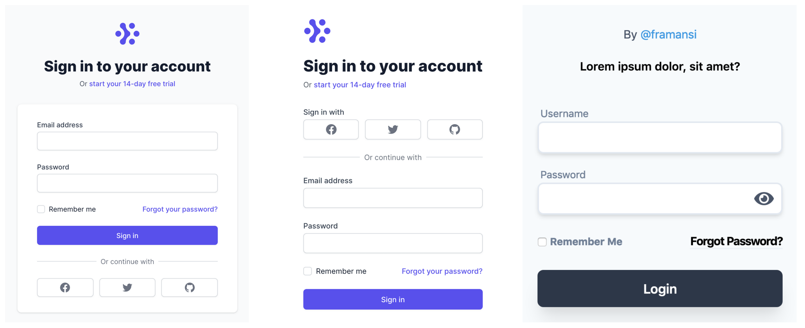

#  AuthUI Server

Authentication-as-a-service

- [AuthUI repo: Login Components](https://github.com/authui/authui)
- [Live Example](https://codesandbox.io/s/authui-example-8jswg?module=/src/LoginPage/LoginPage.tsx)


### Motivations

When starting a new project, it takes some effort to implement Login / Sign-up screens. Often times we have to repeat the same implementation again and again.

- Authentication should be simple to remove frictions to build a MVP (Most Viable Product) or get users started.
- AuthUI takes care of user login & sign up logic.
- Save dev time to focus on main ideas.



- [Live Example](https://codesandbox.io/s/authui-example-8jswg?module=/src/LoginPage/LoginPage.tsx)
- [Login Component Templates - TailwindComponents](https://tailwindcomponents.com/search?query=login)
- [Login Component Templates - TailwindUI templates](https://tailwindcomponents.com/search?query=login)



### Commands

Node 13.x
yarn 1.22.x

server.ts - update PORT

Prepare Database and Seed data:
```
$ yarn generate
$ yarn seed
```

Run Dev:

```
$ yarn dev
```

### Application flows:

- Include the Login Component into the main app and customize it: [Example](https://codesandbox.io/s/authui-example-8jswg?module=/src/LoginPage/LoginPage.tsx)
- The Login Component will make requests to AuthUI login or signup graphql endpoint.
- AuthUI endpoints will respond with a JWT token (contains userId).

### Contributions

Please open pull requests. Any contribution is welcome!